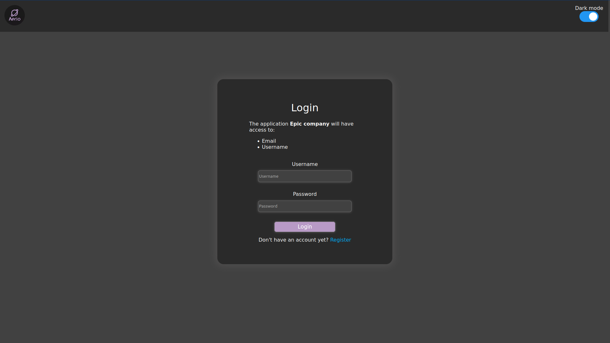
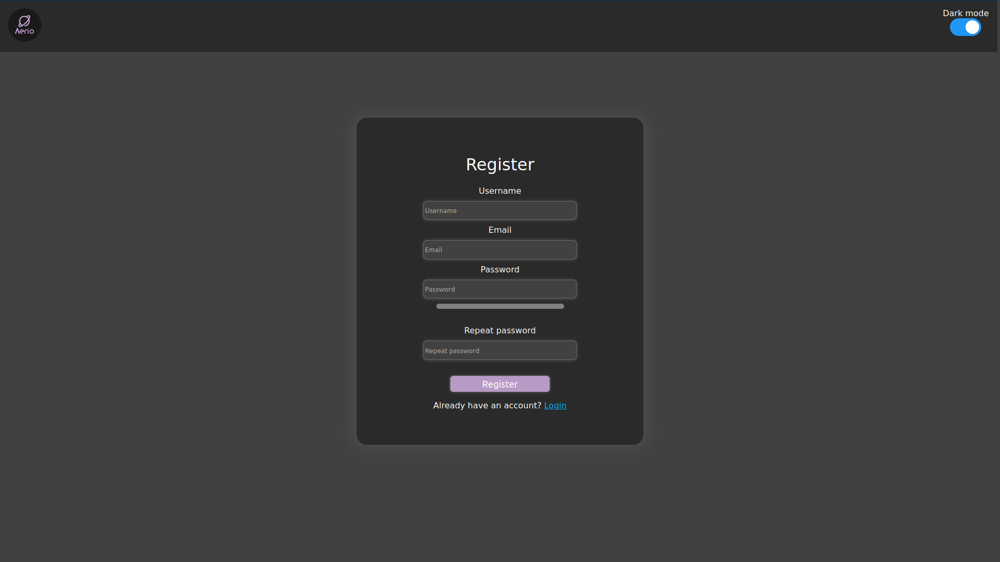

# **Aeiro SSO**

## **How to use**

### Obtaining an access token
For a user to log in using their account, they must be redirected to the sso's domain. An example url for the user to be redirected to would be:

    https://example.domain/login?client_id=<your_client_id>&scope=<scope>&redirect_uri=<redirect_uri>

The user will be redirected to the redirect uri after logging in. The parameters `access_token`, `refresh_token`, `expiration` and `user_id` will be added to the end of the redirect uri. After the user has logged in, the refresh token may be used to obtain a new access token one it expires without the user needing to re-enter their username and password.

### Logging in as the user
To log in you must enter your username and password on the domain to which you have been redirected to. If you do not have an account you can click on the register button and then create an account, you will be taken back to the login page where you will have to re-enter your username and password.

### Create a new account
To register you must enter a username, email and a password on the domain to which you have been redirected to.

## **Internal endpoint documentation**

### /api/users/new
This endpoint will create a new user. It expects a JSON body containing the username and the password of the user to create. Example:

    {
        "username": "john",
        "password": "1234"
    }

This will create a new user and return the status code 201 on success.

### /api/users/authenticate
This endpoint is responsible for returning new access tokens and creating new access tokens from a refresh token, after the original access token has expired.

#### **Create a new access token**
A request to create a new access token would look like this:

    {
        "username": "john",
        "password": "1234",
        "client_id": "<client_id>",
        "scope": 0,
        "response_type: "code"
    }

In this case the server would respond with a 200 response code and a JSON body containing the access token, the refresh token and the expiration date for the access token as a UNIX timestamp.

    {
        "access_token": "<access_token>",
        "refresh_token": "<refresh_token>",
        "expiration": <expiration>,
        "status_code": 201,
        "error": null,
        "success": true
    }

An access token will expire one month after it has been creation.

#### **Use a refresh token to obtain a new access token**
To avoid having to send the user's username and password every time the access token expires, the refresh token is used to obtain a new access token. This can be done by setting the `response_type` field to `refresh`.

    {
        "username": "john",
        "client_id": "<client_id>",
        "refresh_token": "<refresh_token>",
        "response_type": "refresh"
    }

As you can see, here the user's password is not required. This makes it so the application using the API does not have to save the user's password.

The response body from the server would then be identical to the one for obtaining a new access token except the refresh token stays the same.